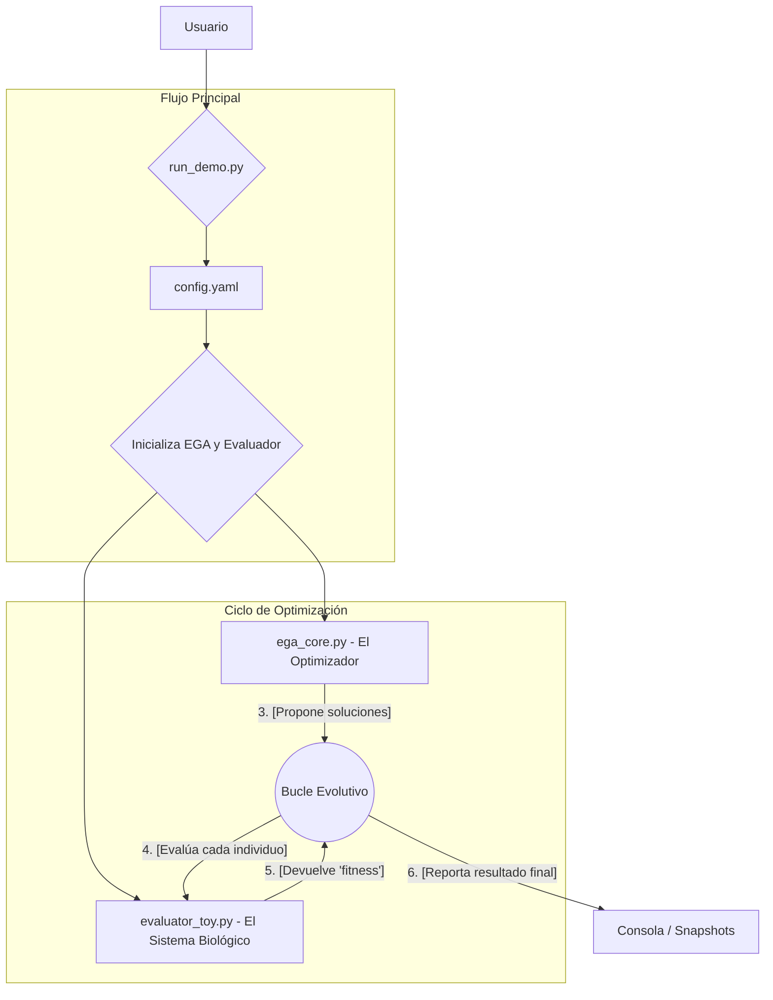

# Análisis del Pipeline de Optimización

## 1. Arquitectura General y Flujo de Datos

El siguiente diagrama ilustra el flujo de operaciones desde la ejecución inicial hasta la obtención de resultados.

[ ega_core.py ] <--------- (4. Bucle Evolutivo) --------> [ evaluator_toy.py ]
(El Optimizador)         (Evalúa cada individuo)         (El Sistema Biológico)
        |                                                          |
        | (3. Propone soluciones)                                  | (5. Devuelve 'fitness')
        

### Flujo de Datos Detallado:

1.  **`run_demo.py`**: Es el director de orquesta. Lee los parámetros desde `config.yaml`.
2.  **Configuración**: Con esta configuración, crea dos objetos principales: una instancia de `EGA` (el motor de búsqueda) y una instancia de `ToyODEEvaluator` (el problema a resolver).
3.  **Población Inicial**: El `EGA` genera una población inicial de "individuos". Cada individuo es un conjunto de parámetros candidatos para el modelo biológico.
4.  **Bucle Evolutivo**: El `EGA` le pide al `evaluator` que determine qué tan "bueno" es cada individuo (solución).
5.  **Evaluación**: El `evaluator` ejecuta una simulación biológica (resuelve las EDOs) con los parámetros del individuo y devuelve un puntaje de *fitness* (un número que indica qué tan cerca estuvo el resultado del objetivo deseado).
6.  **Nueva Generación**: El `EGA` usa estos puntajes para crear una nueva generación de individuos, favoreciendo a los mejores (elitismo, selección) y explorando nuevas posibilidades (cruzamiento, mutación). Este ciclo se repite hasta que se alcanza el número de generaciones definido.

---

## 2. Teoría Aplicada

Esta arquitectura implementa directamente el concepto de **Problema Inverso**.

*   **Modelo**: El sistema de EDOs dentro de `evaluator_toy.py`.
*   **Datos Experimentales**: El `target` en `config.yaml`.
*   **Problema**: Encontrar los parámetros (`prod`, `deg`, `inter`) que hacen que el modelo replique el `target`.
*   **Método de Solución**: El Algoritmo Genético de `ega_core.py`, que explora el vasto "paisaje de fitness" para encontrar la mejor solución.

*   `ega_core.py`: Es pura computación evolutiva. No sabe nada de biología. Su única tarea es optimizar una función objetivo.
*   `evaluator_toy.py`: Es biología de sistemas (simplificada). Contiene el conocimiento del dominio: cómo los genes interactúan (`_ode_system`) y qué define una "buena" solución (`evaluate`).

Esta separación permite cambiar el modelo biológico sin tocar `ega_core.py`.

---

## 3. Puntos Clave de Interpretación

*   **Abstracción**: El EGA trata a cada individuo como una "caja negra". Solo le interesan los parámetros de entrada y el *fitness* de salida.
*   **Costo Computacional**: El cuello de botella es la función `evaluate`. Resolver EDOs es costoso y se hace miles de veces. Se usa `multiprocessing` para paralelizar.
*   **Parámetros Críticos**: Los parámetros en `config.yaml` son cruciales. Definen tanto la búsqueda (`populationSize`, `mutation_rate`) como el problema biológico (`target`, `t_span`).

---

## Mejores Parámetros Encontrados

-   **Estrategia**: `center`
-   **Tamaño de la población**: 21
-   **Generaciones**: 13

### Resultados
-   **Fitness**: `0.07613301180883213`
-   **Último fitness promedio**: `0.22618026193441074`
-   **Distancia a valores objetivo**: `0.031717556494307325`
-   **Valores finales**: `[0.8917965540108554, 0.998157326632536, 0.7694171384802926]`
-   **Valores objetivo**: `[0.9, 1.0, 0.8]`
-   **Puntuación final**: `0.02785653715532283`

---

## Análisis de Tendencias

### Top 5 Mejores Combinaciones

| Rank | Estrategia | Tamaño Población | Generaciones | Score  |
|:----:|:----------:|:----------------:|:------------:|:------:|
| 1    | `center`   | 21               | 13           | 0.0279 |
| 2    | `uniform`  | 42               | 14           | 0.0372 |
| 3    | `center`   | 30               | 16           | 0.0387 |
| 4    | `uniform`  | 76               | 13           | 0.0396 |
| 5    | `uniform`  | 22               | 9            | 0.0404 |

### Rendimiento Promedio por Estrategia

-   **Estrategia 'uniform'**: `0.1792`
-   **Estrategia 'center'**: `0.1619`

### Rendimiento Promedio por Tamaño de Población

-   **Tamaño de población 10**: `0.3644`
-   **Tamaño de población 11**: `0.1753`
-   **Tamaño de población 12**: `0.2511`
-   **Tamaño de población 13**: `0.1530`
-   **Tamaño de población 14**: `0.1708`
-   **Tamaño de población 15**: `0.1801`
-   **Tamaño de población 16**: `0.1747`
-   **Tamaño de población 17**: `0.1913`
-   **Tamaño de población 18**: `0.1713`
-   **Tamaño de población 19**: `0.1605`
-   **Tamaño de población 20**: `0.1717`
-   **Tamaño de población 21**: `0.1615`
-   **Tamaño de población 22**: `0.1849`
-   **Tamaño de población 23**: `0.1946`
-   **Tamaño de población 24**: `0.1847`
-   **Tamaño de población 25**: `0.1687`
-   **Tamaño de población 26**: `0.1874`
-   **Tamaño de población 27**: `0.1937`
-   **Tamaño de población 28**: `0.1632`
-   **Tamaño de población 29**: `0.1638`
-   **Tamaño de población 30**: `0.1722`
-   **Tamaño de población 31**: `0.1641`
-   **Tamaño de población 32**: `0.1709`
-   **Tamaño de población 33**: `0.1859`
-   **Tamaño de población 34**: `0.1629`
-   **Tamaño de población 35**: `0.1786`
-   **Tamaño de población 36**: `0.1732`
-   **Tamaño de población 37**: `0.1687`
-   **Tamaño de población 38**: `0.1622`
-   **Tamaño de población 39**: `0.1673`
-   **Tamaño de población 40**: `0.1537`
-   **Tamaño de población 41**: `0.1646`
-   **Tamaño de población 42**: `0.1634`
-   **Tamaño de población 43**: `0.1682`
-   **Tamaño de población 44**: `0.1623`
-   **Tamaño de población 45**: `0.1772`
-   **Tamaño de población 46**: `0.1744`
-   **Tamaño de población 47**: `0.1588`
-   **Tamaño de población 48**: `0.1651`
-   **Tamaño de población 49**: `0.1760`
-   **Tamaño de población 50**: `0.1748`
-   **Tamaño de población 51**: `0.1577`
-   **Tamaño de población 52**: `0.1784`
-   **Tamaño de población 53**: `0.1748`
-   **Tamaño de población 54**: `0.1791`
-   **Tamaño de población 55**: `0.1718`
-   **Tamaño de población 56**: `0.1629`
-   **Tamaño de población 57**: `0.1641`
-   **Tamaño de población 58**: `0.1532`
-   **Tamaño de población 59**: `0.1726`
-   **Tamaño de población 60**: `0.1813`
-   **Tamaño de población 61**: `0.1704`
-   **Tamaño de población 62**: `0.1768`
-   **Tamaño de población 63**: `0.1703`
-   **Tamaño de población 64**: `0.1697`
-   **Tamaño de población 65**: `0.1642`
-   **Tamaño de población 66**: `0.1596`
-   **Tamaño de población 67**: `0.1562`
-   **Tamaño de población 68**: `0.1600`
-   **Tamaño de población 69**: `0.1769`
-   **Tamaño de población 70**: `0.1602`
-   **Tamaño de población 71**: `0.1676`
-   **Tamaño de población 72**: `0.1654`
-   **Tamaño de población 73**: `0.1694`
-   **Tamaño de población 74**: `0.1549`
-   **Tamaño de población 75**: `0.1639`
-   **Tamaño de población 76**: `0.1712`
-   **Tamaño de población 77**: `0.1673`
-   **Tamaño de población 78**: `0.1659`
-   **Tamaño de población 79**: `0.1663`
-   **Tamaño de población 80**: `0.1792`
-   **Tamaño de población 81**: `0.1671`
-   **Tamaño de población 82**: `0.1637`
-   **Tamaño de población 83**: `0.1718`
-   **Tamaño de población 84**: `0.1538`
-   **Tamaño de población 85**: `0.1655`
-   **Tamaño de población 86**: `0.1667`
-   **Tamaño de población 87**: `0.1620`
-   **Tamaño de población 88**: `0.1567`
-   **Tamaño de población 89**: `0.1635`
-   **Tamaño de población 90**: `0.1553`
-   **Tamaño de población 91**: `0.1576`
-   **Tamaño de población 92**: `0.1543`
-   **Tamaño de población 93**: `0.1423`
-   **Tamaño de población 94**: `0.1635`
-   **Tamaño de población 95**: `0.1439`
-   **Tamaño de población 96**: `0.1624`
-   **Tamaño de población 97**: `0.1677`
-   **Tamaño de población 98**: `0.1563`
-   **Tamaño de población 99**: `0.1539`
-   **Tamaño de población 100**: `0.1504`
